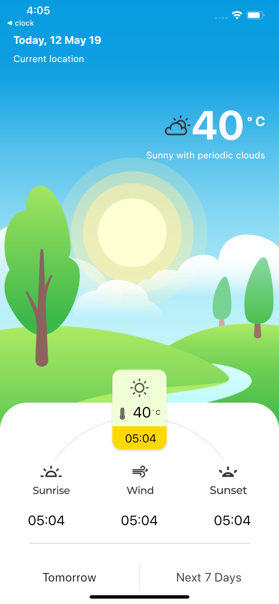
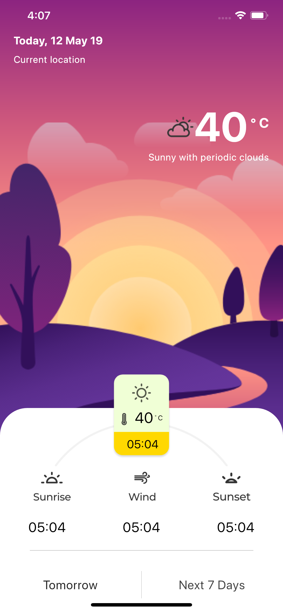
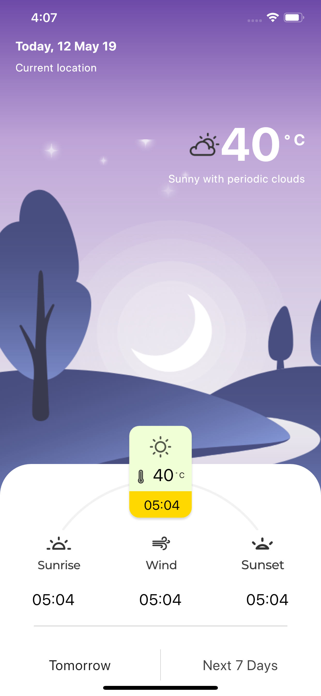

# weather_ui_flutter

This is the source code repository for wather application UI in Flutter. Challenges found on uplabs by [Moataz Mustapha](https://www.uplabs.com/moatazmustapha) 

# Demo

     

# ☁️ Credits

- Designs: [Uplabs](https://www.uplabs.com/posts/weather-a29b437d-6f2d-46cb-8b4c-09f798627d73)

# Getting Started with Flutter

This project is a starting point for a Flutter application.

A few resources to get you started if this is your first Flutter project:

- [Lab: Write your first Flutter app](https://flutter.dev/docs/get-started/codelab)
- [Cookbook: Useful Flutter samples](https://flutter.dev/docs/cookbook)

For help getting started with Flutter, view our
[online documentation](https://flutter.dev/docs), which offers tutorials,
samples, guidance on mobile development, and a full API reference.

# How to hire me

You can hire me as a Flutter Developer or iOS Developer for your project. In case you have a work, you can hire me using [Upwork](https://www.upwork.com/fl/krunalt5) platform or we can open a direct contact via [Email](mailto:krunalelance@gmail.com).

# Follow Me: 

[Twitter](https://www.twitter.com/kttailor4u), 
[Github](https://github.com/kttailor), 
[Linkedin](http://www.linkedin.com/pub/krunal-tailor/22/410/391)
